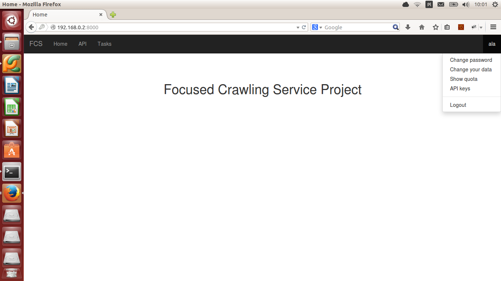

FCS basics
====================

******************
Registration
******************

#. Click on  :guilabel:`Register` button on main page.
    .. image::  images/home.png
       :align:   center
       :scale:   50%
#. Fill fields with user name, correct email and password (two times the same).
    .. image::  images/reg1.png
       :align:   center
       :scale:   50%
#. Confirm with :guilabel:`Register` button.
#. Check your email. Registration message should wait for you. Click the link in email content.
    .. image::  images/reg2.png
       :align:   center
       :scale:   50%
#. Your account is activated. Now you can log in with your email or login and password.

******************
Main page
******************

On main page you can:

* :guilabel:`API` - see REST API documentation,
* :guilabel:`Tasks` - display information about crawling tasks,
* :guilabel:`Change password` - change your password,
* :guilabel:`Change your data` - modify details of your account,
* :guilabel:`Show quota` - check your permissions in creating task,
* :guilabel:`API keys` - view keys required for using REST API,
* :guilabel:`Logout` - finish work with system.

*********************
List of tasks
*********************

This page presents all tasks of current user. They can be active (yellow rows), paused (grey rows) and finished
(green rows). To decrease amount of elements in table you can filter them with two select lists and
:guilabel:`Filter` button.

******************
Create new task
******************

#. Click :guilabel:`Add` button under tasks' list table.
#. Fill form below. If not tell otherwise, all fields are mandatory.
    .. image::  images/c1.png
        :align:   center
        :scale:   50%
#. In first row specify task's name.
#. Fill priority field with number from 1 to 10. The higher it is, the more important is this task
    in comparison with other tasks of this user.
#. Give start links separated with white space.
#. In the :guilabel:`whitelist` field you can specify list of regular expressions (separate them with comma)
    describing urls, which can be processed. If you leave this input empty, all urls will be crawled.
#. :guilabel:`Blacklist` is list of regular expressions which cannot be crawled. Optional.
#. In the next field set the maximal amount of pages which can be crawled.
#. Select maximal date of task lasting in :guilabel:`Expire` field.
#. In last input you can type list of MIME types which should be processed by crawler.
#. Send form with :guilabel:`Add`.
#. If you see message like below, task was created successfully.
    .. image::  images/c2.png
        :align:   center
        :scale:   50%

******************
Edit existing task
******************

#. Click one of the rows in table with tasks.
#. If task is finished, you cannot change anything. View should look like below:
    .. image::  images/e1.png
        :align:   center
        :scale:   50%
#. If task is running or paused you can change some of its parameters, pause/resume it, stop, get crawling results:
    .. image::  images/e2.png
        :align:   center
        :scale:   50%
#. After modifying task click :guilabel:`Save changes`.

******************
Send feedback
******************

If task is running or paused, on task edition page you can rate some pages. To send feedback to Task Server,
you need to specify url and rating. Higher than 3 means that link is valuable, lower means that link is useless.
Confirm with :guilabel:`Send feedback` button.

**************************
Download crawling results
**************************

On the same page you can also download crawling results. Click :guilabel:`Get data`. In window which appears set
size in MB of file with part of results. Click :guilabel:`OK` and download should begin.

